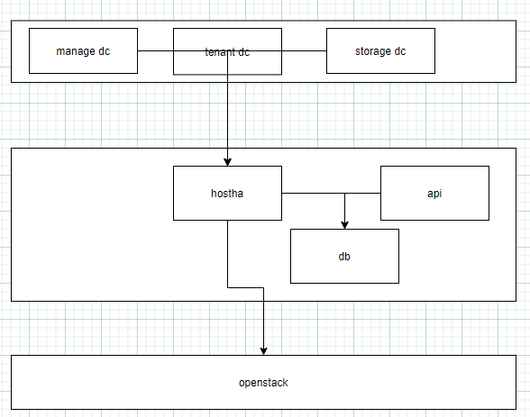

# hostha

#### 介绍
Compute High Availability for OpenStack

项目通过在存储网、 数据网、管理网获取监控数据，然后对监控数据分析。

当发生异常时，数据通过决策矩阵，得到要执行的动作，动作包括隔离 疏散等。

支持下列场景下的虚拟机自动疏散
* 节点掉电
* 系统崩溃
* 存储连接异常
* 业务连接异常

#### 软件架构

*说明*
* 集群内节点（数目>3）通过consul 组成一个集群，提供监控数据，
  manage(管理) tenant(业务) storage(存储) dc根据实际情况调整，不一定都需要
* hostha 通过consulapi获取监控数据，当发生异常时，分析异常数据，通过决策矩阵，
  得到执行的动作，并记录数据库，然后掉用openstack接口实现疏散
* api提供节点信息配置，疏散记录查询等

#### 安装教程

参考 [INSTALL.md](INSTALL.md)

后期考虑容器化便于快速部署

#### 使用说明

参考 [INSTALL.md](INSTALL.md)

#### 参与贡献

1.  Fork 本仓库
2.  新建 Feat_xxx 分支
3.  提交代码
4.  新建 Pull Request

#### 特技

1.  使用 Readme\_XXX.md 来支持不同的语言，例如 Readme\_en.md, Readme\_zh.md
2.  Gitee 官方博客 [blog.gitee.com](https://blog.gitee.com)
3.  你可以 [https://gitee.com/explore](https://gitee.com/explore) 这个地址来了解 Gitee 上的优秀开源项目
4.  [GVP](https://gitee.com/gvp) 全称是 Gitee 最有价值开源项目，是综合评定出的优秀开源项目
5.  Gitee 官方提供的使用手册 [https://gitee.com/help](https://gitee.com/help)
6.  Gitee 封面人物是一档用来展示 Gitee 会员风采的栏目 [https://gitee.com/gitee-stars/](https://gitee.com/gitee-stars/)
